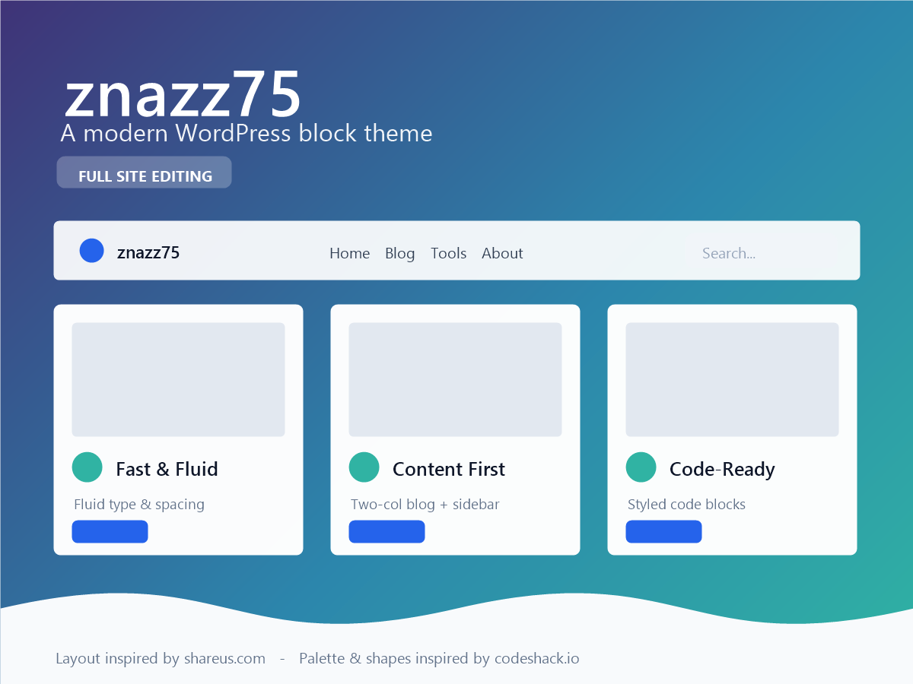

# znazz75

A modern WordPress **block theme** (full-site editing / FSE) built entirely on core Gutenberg blocks — no page builder required.

- **Structural layout** inspired by [shareus.com](https://www.shareus.com/) — sticky header, gradient hero with search, a three-card feature/product row, a two-column blog grid with a persistent sidebar, and a multi-column footer.
- **Colors & shapes** inspired by [codeshack.io](https://codeshack.io/) — a slate-and-blue palette, soft shadows, rounded cards and code-friendly typography.

> Both sites were used only as **visual/structural references** (layout, palette, corner radii, shadow style) during design. No markup, CSS, images or text from either site is included in this theme — every template, pattern, icon and style rule here was authored from scratch for znazz75.

## Highlights

- Gradient hero with integrated search and a stats strip
- Feature/product card row (three-card grid with icon, text and CTA)
- Latest posts grid with category chips, hover lift and equal-height cards
- Blog index / archive / search results in a two-column layout with a sticky sidebar
- Single post template with meta chips, tags, post navigation and threaded comments
- Multi-column footer with page list, categories, social icons and a newsletter signup form
- Fluid typography and fluid spacing, defined entirely in `theme.json`
- A bundled **Dark** style variation (`Appearance → Editor → Styles`)
- Reusable block patterns: hero, stats, products, latest posts, newsletter, post card, sidebar
- Custom block styles: Pill buttons, Chip post-terms, Card groups/columns, Rounded images
- No external font, script or tracking requests — self-hosted/system fonts only

## Requirements

- WordPress 6.4+
- PHP 7.4+

## Installation

1. Download the latest [release](../../releases) zip, or clone this repo into `wp-content/themes/`.
2. In wp-admin go to **Appearance → Themes → Add New → Upload Theme** (if using the zip), or just activate it if you cloned it directly into `wp-content/themes/znazz75`.
3. Activate **znazz75**.
4. Optional: go to **Appearance → Editor → Styles** and pick the **Dark** style variation.

See [readme.txt](readme.txt) (WordPress.org-format readme) for the full description, FAQ and changelog, and the **Recommended Plugins** section below for how to reproduce specific functionality from the two reference sites (e.g. syntax-highlighted code blocks).

## Local development (XAMPP)

This theme was built and tested against a local [XAMPP](https://www.apachefriends.org/) stack (Apache + MySQL + PHP 8.2):

1. Install XAMPP and start **Apache** and **MySQL** from the control panel.
2. Install WordPress into `C:\xampp\htdocs\wordpress` (or your preferred folder) and create a database for it via phpMyAdmin.
3. Copy or symlink this repository into `C:\xampp\htdocs\wordpress\wp-content\themes\znazz75`.
4. Activate the theme in wp-admin at `http://localhost/wordpress/wp-admin/`.

## Recommended plugins

The theme intentionally ships as **layout, typography and color only** — it does not bundle plugin-territory features (search relevance, syntax highlighting, forms, e‑commerce, consent banners, etc.), since those vary by taste and site. The full list of free/freemium WordPress.org plugins recommended to match specific functionality seen on shareus.com and codeshack.io — most notably **displaying source code in posts** — is documented in [readme.txt](readme.txt) under **"Recommended Plugins"**.

## License

[GNU General Public License v2.0 or later](LICENSE).

This theme bundles no third-party fonts, images, icon fonts or JavaScript libraries — its inline SVG icons were authored for this theme.

## Changelog

### 1.0.1
- Fixed a large batch of block-validation errors ("Block contains unexpected or invalid content") caused by block comments whose declared padding/margin/color/font-size attributes weren't mirrored into the saved HTML.
- Fixed the single post Comments block: it was missing its wrapper and never actually displayed existing/threaded comments on the front end — only the reply form. It now renders a proper comment list (avatar, author, date, content, reply link) with pagination.
- Fixed the release zip, which had backslash path separators (from PowerShell's `Compress-Archive`) that made WordPress unable to see `style.css` inside it.
- Fixed `LICENSE` (was a raw HTTP redirect page) and `screenshot.png` (stale placeholder branding).
- Fixed a responsive overflow bug in the header below ~1024px and missing root padding on narrow viewports.

### 1.0.0
- Initial public release.
